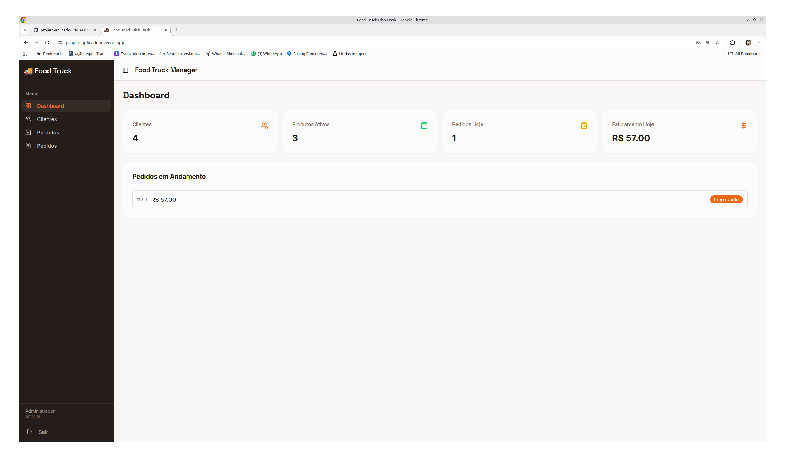
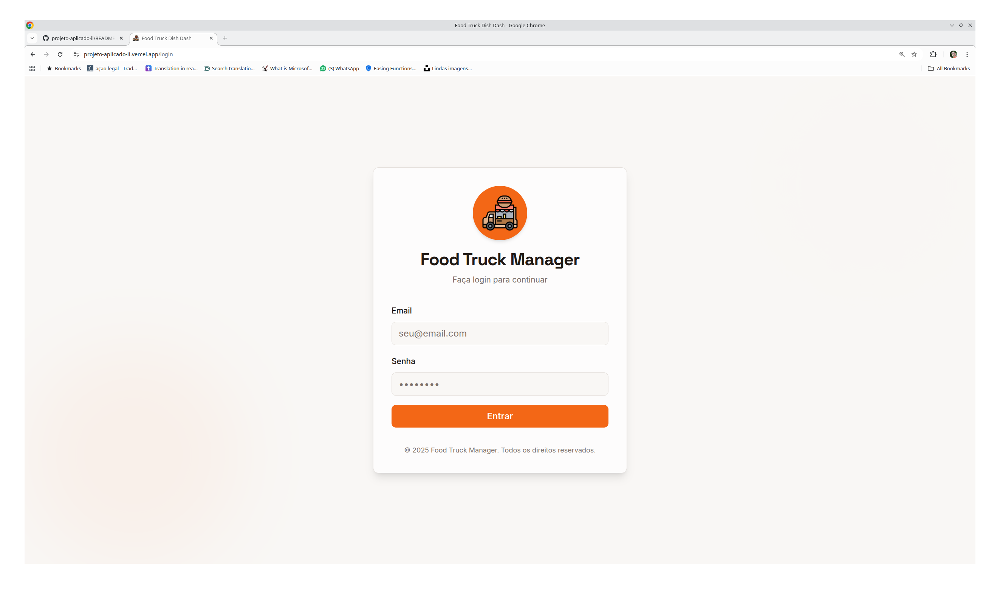
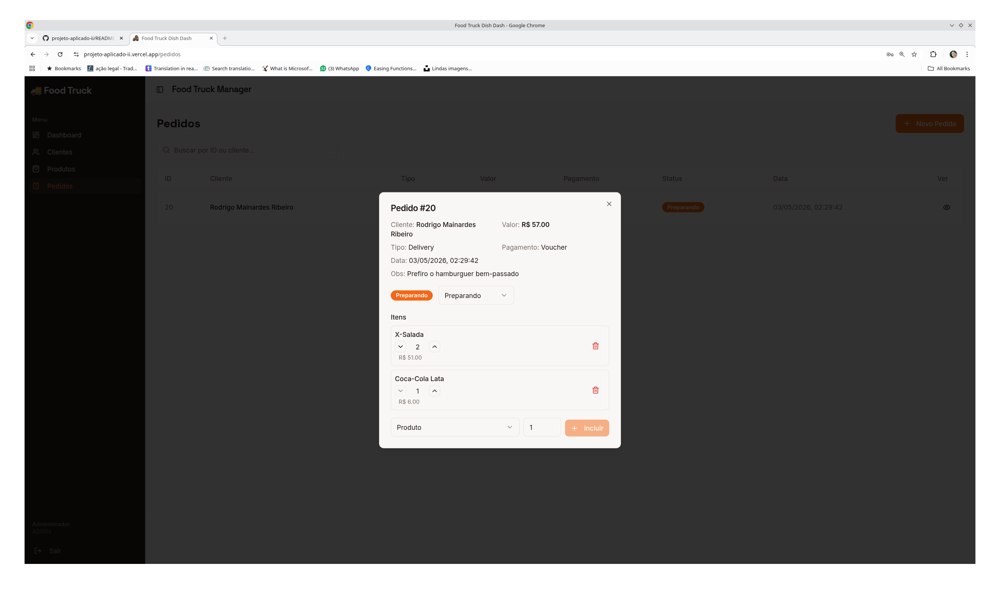
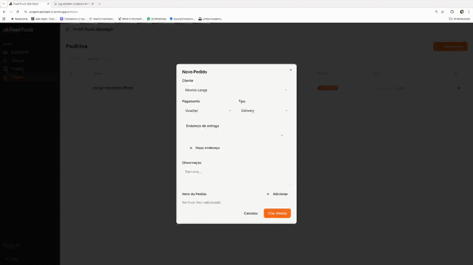

# Food Truck App

<p align="center">
  
</p>

<p align="center">
  Sistema de controle de pedidos para food truck, com autenticação, estoque, clientes, endereços e pedidos em um fluxo completo de operação.
</p>

<p align="center">
  
  
  
  
  
</p>

---

## Highlights

- **Fluxo completo de pedidos**, desde a seleção de produtos até a atualização de status.
- **Controle de estoque**, com bloqueio de pedidos quando não há disponibilidade.
- **Autenticação com bcrypt e JWT**, preparada para ambiente real.
- **Front-end e back-end bem separados**, com integração via API REST.
- **Interface responsiva**, pensada para uso rápido no balcão e no mobile.
- **Validações consistentes**, tanto no front quanto no back.
- **Endereços com consulta de CEP**, incluindo endereço principal por cliente.

---

## Demonstração

<table>
  <tr>
    <td width="50%">
      
    </td>
    <td width="50%">
      
    </td>
  </tr>
</table>

<p align="center">
  
</p>

---

## Sobre o projeto

O Food Truck App é um sistema web para controle de pedidos, clientes, produtos e endereços, com foco em atendimento ágil e organização operacional.

A aplicação foi construída com front-end em React/Vite e back-end em Quarkus, consumindo uma API REST e usando PostgreSQL como base relacional. O projeto foi pensado para funcionar bem em telas menores, com navegação clara e formulários rápidos de usar.

---

## Funcionalidades

- Login com autenticação JWT.
- Cadastro, edição e exclusão de clientes.
- Cadastro e manutenção de endereços por cliente.
- Consulta automática de CEP com autopreenchimento.
- Cadastro, edição, ativação e desativação de produtos.
- Filtro de produtos ativos/inativos.
- Criação de pedidos com múltiplos itens.
- Atualização de status do pedido.
- Regras específicas para consumo no local e delivery.
- Interface responsiva e preparada para uso operacional.

---

## Stack

### Front-end
- React
- Vite
- TypeScript
- React Router
- React Query
- React Hook Form
- Zod
- Axios
- shadcn/ui
- Lucide React

### Back-end
- Quarkus
- Java
- REST API
- JPA / Hibernate ORM
- PostgreSQL
- JWT
- BCrypt

---

## Estrutura do front-end

```txt
src/
├── lib/
│   └── api.ts
├── types/
│   └── api.ts
├── pages/
│   ├── Index.tsx
│   ├── Clientes.tsx
│   ├── Enderecos.tsx
│   ├── Produtos.tsx
│   └── Pedidos.tsx
├── components/
│   ├── Layout.tsx
│   ├── clientes/
│   │   └── ClienteForm.tsx
│   ├── enderecos/
│   │   └── EnderecoForm.tsx
│   ├── produtos/
│   │   └── ProdutoForm.tsx
│   └── pedidos/
│       ├── PedidoForm.tsx
│       └── PedidoDetail.tsx
```

---

## Principais endpoints

### Clientes

| Ação | Método | Endpoint |
| --- | --- | --- |
| Listar | GET | `/clientes` |
| Criar | POST | `/clientes` |
| Editar | PUT | `/clientes/{id}` |
| Excluir | DELETE | `/clientes/{id}` |

### Endereços

| Ação | Método | Endpoint |
| --- | --- | --- |
| Listar por cliente | GET | `/clientes/{idCliente}/enderecos` |
| Buscar principal | GET | `/clientes/{idCliente}/enderecos/principal` |
| Criar | POST | `/clientes/{idCliente}/enderecos` |
| Consultar CEP | GET | `/enderecos/cep/{cep}` |
| Editar | PUT | `/clientes/{idCliente}/enderecos/{id}` |
| Excluir | DELETE | `/clientes/{idCliente}/enderecos/{id}` |
| Definir principal | PATCH | `/clientes/{idCliente}/enderecos/{id}/principal` |

### Produtos

| Ação | Método | Endpoint |
| --- | --- | --- |
| Listar | GET | `/produtos` |
| Criar | POST | `/produtos` |
| Editar | PUT | `/produtos/{id}` |
| Desativar | DELETE | `/produtos/{id}` |

### Pedidos

| Ação | Método | Endpoint |
| --- | --- | --- |
| Listar | GET | `/pedidos` |
| Criar | POST | `/pedidos` |
| Editar status | PUT | `/pedidos/{id}` |
| Adicionar item | POST | `/pedidos/{id}/itens` |
| Remover item | DELETE | `/pedidos/{id}/itens/{id_item}` |

---

## Como executar

### Front-end
```bash
cd front-end
npm install
npm run dev
```

### Back-end
```bash
cd back-end
./mvnw quarkus:dev
```

---

## Melhorias futuras

- Dashboard com métricas do dia.
- Histórico de pedidos.
- Impressão de pedidos.
- Testes unitários e de integração.
- Melhor observabilidade e tratamento de erros.
- Autenticação e autorização completas no fluxo do front.

---

## Autor

Rodrigo Mainardes
